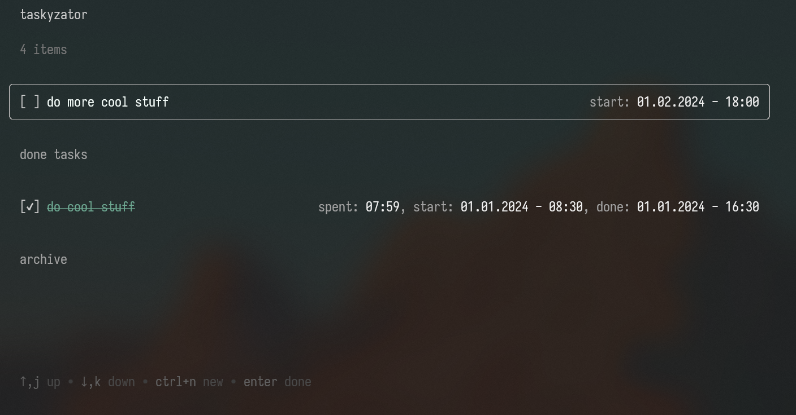

# taskyzator

[](https://github.com/DECE2183/taskyzator/blob/main/LICENSE)
[](https://goreportcard.com/report/github.com/dece2183/taskyzator)
[](https://github.com/dece2183/taskyzator/releases)

**taskyzator** is a simple task manager application with terminal UI.



## Tasks

The tasks are stored in a `yaml` file at `~/.config/taskyzator/tasklist.yaml`.

The task structure looks like:

```yaml
name: do more cool stuff
status: 0
begin-time: 2024-02-01T18:00:00.2044045+03:00
done-time: 0001-01-01T00:00:00Z
```

Available `status` values:

| Value | Description      |
| ----- | ---------------- |
| `0`   | Task is active   |
| `1`   | Task is done     |
| `2`   | Task is archived |

## Configuration

The configuration file is located at `~/.config/taskyzator/config.yaml`. It allows to define control keys and text colors.

This is the default configuration which is automatically created after the first startup:

```yaml
controls:
    quit: ctrl+q,ctrl+c
    apply: enter
    cancel: esc
    cursor-up: up,j
    cursor-down: down,k
    new-task: ctrl+n
    done-task: enter
    undone-task: ctrl+u
    archive-task: del
    unarchive-task: ctrl+u
    delete-task: shift+del,alt+insert
style:
    error-color: '#F33'
    accent-color: '#0cc47e'
    dimmed-color: '#a3a3a3'
    normal-color: '#f2f2f2'
    active-task-text-color: '#f7fffc'
    done-task-text-color: '#6ca690'
    archived-task-text-color: '#7d7d7d'
```
